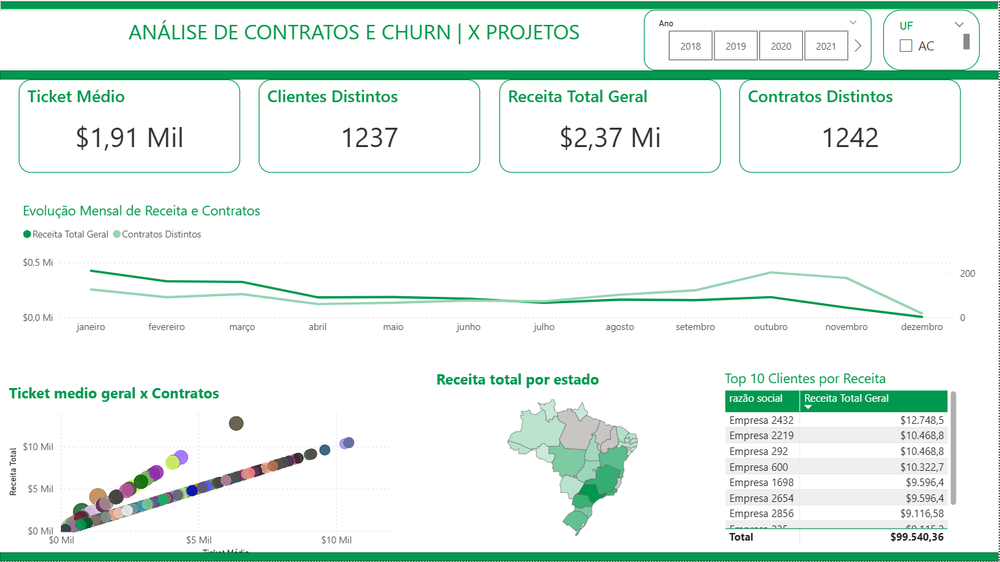

# Contracts and Churn Analysis Dashboard

Data Analysis | Business Intelligence | Power BI

---

## 🇧🇷 Português

Este projeto apresenta um dashboard desenvolvido em **Power BI** para análise de contratos, receita e churn de clientes.

O objetivo é acompanhar indicadores de desempenho e entender a relação entre **clientes, contratos e receita**, permitindo identificar tendências de crescimento, concentração de receita e comportamento dos clientes.

O painel permite visualizar a evolução da receita ao longo do tempo, identificar os principais clientes e analisar a distribuição geográfica da receita.

---

### Principais indicadores

- Ticket médio
- Clientes distintos
- Contratos ativos
- Receita total
- Evolução mensal de receita
- Receita total por estado
- Top 10 clientes por receita

---

### Ferramentas utilizadas

- Power BI
- DAX
- Modelagem de dados
- Visualização de dados

---

### Visualização do Dashboard

---

## 🇺🇸 English

This project presents a **Power BI dashboard** developed to analyze contracts, revenue, and customer churn.

The objective is to track performance indicators and understand the relationship between **customers, contracts, and revenue**, helping identify growth trends, revenue concentration, and customer behavior.

The dashboard enables the visualization of revenue evolution over time, identification of top clients, and analysis of revenue distribution across regions.

---

### Tools used

- Power BI
- DAX
- Data modeling
- Data visualization
